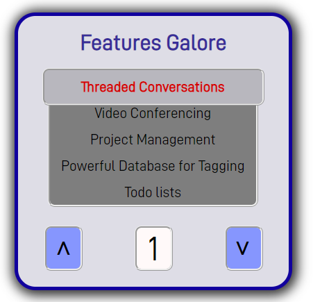
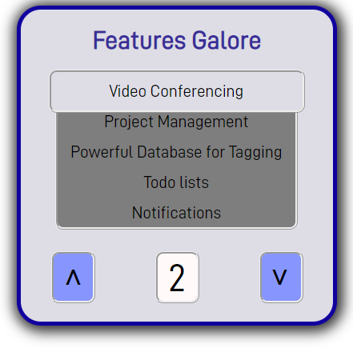

# Animation with Vannila JS

## Table of contents

- [Description](#Description)
- [Screenshot](#screenshot)
- [Links](#links)
- [Built with](#built-with)
- [Author](#author)

## Users should be able to:

- See features coming up to the top screen while animation happens.

- Manipulate features by pressing the up and down button.
  </br>

### Screenshots

</br>
<p align="center">
    
</p>
</br>
</br>
<p align="center">
    
</p>
</br>

### Links

- Live Site URL: [thiagoando.github](https://thiagoando.github.io/Features-Galore/)

### Built with

- Semantic HTML5 markup
- CSS custom properties
- Java Script

### Description

That is an animation built with Java Script in which 15 features move up automatically one by one and get animated when positioned on the main screen. It also can be moved up or down by using the buttons. As I have been practising programming with JS, I got expired by the curse [Animation with JavaScript and jQuery](https://www.coursera.org/learn/animation-javascript-jquery?specialization=javascript-beginner) on Coursera platform to create a program with nice animations using only JS and CSS. It is said that to learn how to code, we need to train it. Actually, that is the best part of the learning process. It is nice to learn a new skill. However, it is much nicer to put it into practice by creating programs from scratch using your creativity.

You can check the code used to make it below:
### HTML 
```html
<!DOCTYPE html>
<html lang="en">
<head>
    <meta charset="UTF-8">
    <meta http-equiv="X-UA-Compatible" content="IE=edge">
    <meta name="viewport" content="width=device-width, initial-scale=1.0">

    <title>Bare Bones Layout</title>
    <meta name="description" content="This is a DOM manipulation made with JS">
    <meta name="author" content="Features Galore">


    <!--Open Graph Protocol
    <meta property="og:title" content="a brief description">
    <meta property="og:type" content="website">
    <meta property="og:url" content="https://www.mysite">
    <meta property="og:description" content="a brief description">
    <meta property="og:image" content="image.png">

    <link rel="icon" href="./favicon.ico">
    <link rel="icon" href="./favicon.svg" type="image/svg+xml">
    <link rel="./apple-touch-icon" href="/apple-touch-icon.png">
-->


    <link rel="stylesheet" href="./css/style.css">
</head>
<body>
   <div id="container">
          <h1>Features Galore</h1>
            <div id="features">
              <ul class="eachfeature transition">
                <li>Threaded Conversations</li>
                <li>Video Conferencing</li>
                <li>Project Management</li>
                <li>Powerful Database for Tagging</li>
                <li>Todo lists</li>
                <li>Notifications</li>
                <li>Professional templates</li>
                <li>Custom Templates</li>
                <li>Sharing via URL</li>
                <li>Workspaces</li>
                <li>Private Pages</li>
                <li>Two Factor Authentication</li>
                <li>Powerful API for Developers</li>
                <li>Drag and Drop Interface</li>
                <li>Custom Styling</li>
              </ul>
               <div id="upper-scren"><div></div></div>
               <div id="back-scren"></div>
               <div id="lower-scren"></div>
            </div>
            <div id="btn-conteiner">
                <div class="btn" id="btn_1"><p><</p></div>
                <div class="count" id="count_1"><p>1</p></div>
                <div class="btn" id="btn_2"><p>></p></div>
            </div>
          </div>

    </footer>
         <script src="./js/script.js"></script>

</body>
</html>
```
### CSS
```css
@font-face {
  font-family: D-DIN-Regular;
  src: url(../fonts/fonts-D-DIN.woff2) format("woff2"), url(../fonts/fonts-D-DIN.woff)
      format("woff"), url(fonts/D-DIN.otf) format("opentype");
  font-style: normal;
  font-weight: 400;
}

body {
  display: flex;
  align-content: center;
  height: 100vh;
  font-family: D-DIN-Regular;
  margin: 0;
  padding: 0;
  font-size: 16px;
  color: black;
}

* {
  box-sizing: border-box;
  margin: 0;
}

#container {
  width: 400px;
  height: 400px;
  border: solid #11009e 5px;
  border-radius: 30px;
  box-shadow: #333 2px 2px 16px 6px;
  margin: auto;
  background-color: #dedde6;
}

#container h1 {
  color: #392e99;
  font-weight: 800;
  margin-top: 20px;
  margin-bottom: 20px;
  text-align: center;
}

#container > #features {
  position: relative;
  width: 82%;
  margin: auto;
  height: 200px;
  overflow: hidden;
  border-radius: 10px;
  margin-top: 5px;
}

#container .eachfeature {
  position: absolute;
  list-style: none;
  padding: 0;
  top: 0;
  left: 27px;
  z-index: 2;
  margin-top: 15px;
}

.transition {
  transition: top 1000ms cubic-bezier(0.165, 0.84, 0.44, 1);
}

.eachfeature_cloned {
  list-style: none;
  padding: 0;
  z-index: 2;
  transition: top 1000ms cubic-bezier(0.165, 0.84, 0.44, 1);
}

#container > #features li {
  margin-bottom: 15px;
  text-align: center;
  font-size: 1.3rem;
}

#container > #features > #upper-scren {
  position: absolute;
  top: 0;
  width: 100%;
  height: 54px;
  border: 1mm ridge;
  border-radius: 10px;
  z-index: 3;
}

#container > #features > #upper-scren > div {
  position: absolute;
  display: none;
  top: 0;
  left: 0;
  width: 100%;
  height: 49px;
  background-color: rgba(0, 0, 0, 0.171);
  border-radius: 7px;
}

/* ------------------ANIMATION---------------------- */

.leftToRight {
  animation-name: leftToRight;
  animation-timing-function: ease;
  animation-duration: 1s;
}

@keyframes leftToRight {
  from {
    width: 0%;
  }
  to {
    width: 100%;
  }
}

.leftToRightBack {
  animation-name: leftToRightBack;
  animation-timing-function: ease;
  animation-duration: 1s;
}

@keyframes leftToRightBack {
  from {
    left: 0px;
    width: 100%;
  }
  to {
    left: 312px;
    width: 0%;
  }
}

.righttoLeft {
  animation-name: righttoLeft;
  animation-timing-function: ease;
  animation-duration: 1s;
}

.pressed {
  box-shadow: #333 0px 0px 0px 3px;
}

@keyframes righttoLeft {
  from {
    left: 312px;
  }
  to {
    left: 0px;
  }
}

.RighttoLeftBack {
  animation-name: RighttoLeftBack;
  animation-timing-function: ease;
  animation-duration: 1s;
}

@keyframes RighttoLeftBack {
  from {
    left: 0px;
  }
  to {
    left: -312px;
  }
}

/* ----------------END OF ANIMATION------------------------ */
* #container > #features > #lower-scren {
  position: absolute;
  top: 54px;
  width: 95%;
  left: 7.5px;
  height: 146px;
  border-left: 1mm ridge;
  border-right: 1mm ridge;
  border-bottom: 1mm ridge;
  border-radius: 0px 0px 10px 10px;
  z-index: 4;
  background-color: rgba(0, 0, 0, 0.507);
}

#back-scren {
  position: absolute;
  top: 54px;
  width: 95%;
  left: 7.5px;
  height: 146px;
  border-radius: 0px 0px 10px 10px;
  background-color: white;
}

#container > #btn-conteiner {
  display: flex;
  justify-content: space-around;
  align-items: center;
  width: 100%;
  top: 20px;
  margin-top: 30px;
  height: 60px;
}

#container > #btn-conteiner > .btn,
.count {
  font-size: 3rem;
  width: 55px;
  height: 65px;
  background-color: #8696fe;
  display: flex;
  align-content: center;
  justify-content: center;
  border: 1mm ridge;
  border-radius: 10px;
}

#container > #btn-conteiner > .btn {
  cursor: pointer;
}

#container > #btn-conteiner > #btn_1 p {
  rotate: 90deg;
}

#container > #btn-conteiner > #btn_2 p {
  rotate: 90deg;
  margin-right: 3px;
}

#container > #btn-conteiner > .count {
  background-color: #fff9f9;
}

#container > #btn-conteiner > .count > p {
  padding-top: 4px;
}

body > div > a {
  text-decoration: none;
  color: aqua;
}
```
### JS
```js
window.addEventListener("load", function () {
  let listItems;
  let list;
  let count = 0;
  let animationCount = 0;
  let top = 38;
  let length;
  let countText = 0;
  let screenNumber;
  let display;
  let lists;
  let cloned;
  let timer_3;
  let timer_4;
  let timer_5;
  let reload;
  let listQtt = 0;
  let listCount = 1;
  let click = 0;
  let button_1 = this.document.getElementById("btn_1");
  let button_2 = this.document.getElementById("btn_2");
  let moveScreen = this.document.querySelector(
    "#container > #features > #upper-scren > div"
  );
  upAnimation();
  // List animation====================================================
  listItems = this.document.querySelectorAll("#features ul li");
  length = listItems.length;
  list = this.document.querySelector("#features > ul");

  function getList(par) {
    if (par == undefined || par == 1) {
      list = this.document.querySelector("#features > ul:first-of-type");
      listItems = this.document.querySelectorAll("#features ul li");
      lists = document.querySelectorAll("#features > ul ul ");
      cloned = this.document.querySelector("#features  ul:first-of-type");
    }
  }

  let timer_2 = setInterval(() => {
    listUp();
  }, 4000);

  function listUp() {
    getList();
    list.style.top = `-${top}px`;
    top += 38;
    count++;
    getDisplay(count);
    changeDisplay(1);

    if (count == length - 5) {
      count = 0;
      addItem();
    }
  }

  function addItem() {
    let clonedMenu;
    getList();
    listQtt++;
    clonedMenu = list.cloneNode(true);
    clonedMenu.className = "eachfeature_cloned";
    list.appendChild(clonedMenu);
    if (listQtt > 1 && lists.length > 2) {
      listQtt = 0;
      removeItem(1);
    } else if (listQtt > 1 && lists.length < 2) {
      removeItem();
      listQtt = 0;
    }
  }

  function removeItem(call) {
    let list_2;
    let list_3;
    getList();
    if (call == undefined) {
      remoItemPartTwo();
    } else if (call == 1 && lists.length == 1) {
      remoItemPartTwo();
    } else if (call == 1 && lists.length > 1) {
      list_3 = document.querySelector("#features> ul > ul:last-of-type");
      cloned.removeChild(list_3);
      remoItemPartTwo();
    }
    function remoItemPartTwo() {
      list_2 = document.querySelector("#features> ul > ul:first-of-type");
      cloned.removeChild(list_2);
    }
  }
  // End of List animation==============================================

  // Up screen animation================================================

  setTimeout(() => {
    listItems[countText].style.color = "red";
    listItems[countText].style.fontWeight = "700";

    setTimeout(() => {
      listItems[countText].style.color = "black";
      listItems[countText].style.fontWeight = "400";
    }, 1100);
  }, 800);

  let timer_1 = setInterval(() => {
    upAnimation();
  }, 4000);

  function upAnimation() {
    if (animationCount == 2) {
      animationCount = 0;
    }
    animationCount++;
    function textAnimation() {
      countText++;
      timer_4 = setTimeout(() => {
        listItems[countText].style.color = "red";
        listItems[countText].style.fontWeight = "700";

        timer_5 = setTimeout(() => {
          listItems[countText].style.color = "black";
          listItems[countText].style.fontWeight = "400";
          listItems.forEach((li) => {
            li.style.color = "black";
            li.style.fontWeight = "400";
          });
        }, 1000);
      }, 2900);
    }
    switch (animationCount) {
      case 1:
        moveScreen.className = "leftToRight";
        moveScreen.style.display = "block";
        setTimeout(() => {
          moveScreen.className = "leftToRightBack";
          textAnimation();
          setTimeout(() => {
            moveScreen.style.display = "none";
          }, 1000);
        }, 2000);
        break;
      case 2:
        moveScreen.className = "righttoLeft";
        moveScreen.style.display = "block";
        setTimeout(() => {
          moveScreen.className = "RighttoLeftBack";
          textAnimation();
          setTimeout(() => {
            moveScreen.style.display = "none";
          }, 1000);
        }, 2000);
        break;
      default:
        moveScreen.style.display = "none";
    }
  }

  // End of screen animation===============================================

  // Start of buttons animation=============================================

  button_1.addEventListener("click", () => {
    callFunctions();
    button_1.classList.add("pressed");
    document.getElementById("btn_1").style.color = "red";
    setInterval(() => {
      button_1.classList.remove("pressed");
      document.getElementById("btn_1").style.color = "black";
    }, 400);
    list.removeChild(listItems[0]);
    var li = document.createElement("li");
    li.appendChild(document.createTextNode(listItems[0].innerHTML));
    list.appendChild(li);
    if (click == listItems.length - 1) {
      getList(1);
    }
  });

  button_2.addEventListener("click", () => {
    callFunctions();
    button_2.classList.add("pressed");
    document.getElementById("btn_2").style.color = "red";
    setInterval(() => {
      button_2.classList.remove("pressed");
      document.getElementById("btn_2").style.color = "black";
    }, 400);
    var li = document.createElement("li");
    li.appendChild(
      document.createTextNode(listItems[listItems.length - 1].innerHTML)
    );
    list.removeChild(listItems[listItems.length - 1]);
    list.insertBefore(li, list.firstChild);
    if (listCount == listItems.length - 1) {
      getList(1);
      listCount = 1;
    } else {
      listCount++;
    }
  });

  function callFunctions() {
    click++;
    clearInterval(timer_1);
    clearInterval(timer_2);
    clearTimeout(timer_3);
    clearTimeout(timer_4);
    clearTimeout(timer_5);
    clearTimeout(reload);
    removeItem(1);
    getList(click);
    getDisplay(click);
    removeStile(click);
    changeDisplay(1);
    reload = setTimeout(function () {
      location.reload();
    }, 3000);
  }

  function getDisplay(num) {
    if (num == 1) {
      screenNumber = this.document.querySelector("#count_1 > p");
      display = parseInt(screenNumber.innerHTML);
    }
  }

  function removeStile(num) {
    if (num == 1) {
      list.style.top = "0px";
      list.classList.remove("transition");
    }
  }

  // End of buttons animation===============================================

  // Start of Display animation=============================================

  function changeDisplay(up) {
    switch (up) {
      case 1:
        if (display == 15) {
          display = 0;
        }
        display++;
        screenNumber.innerHTML = `${display}`;
        break;
      case 2:
        if (display == 1) {
          display = 16;
        }
        display--;
        screenNumber.innerHTML = `${display}`;
        break;
      default:
        alert("Something went wrong with the display");
    }
  }

  // End of Display animation=============================================
});
```

### Continued development

Completing this project made me realize I need to improve my JS skills. This language is versatile and indispensable for building a good and functional user-friendly website. The next step is to use react library on my projects.

## Author

- Website - [Thiago Ando de Freitas](https://thiagoando.github.io/Portfolio/)
